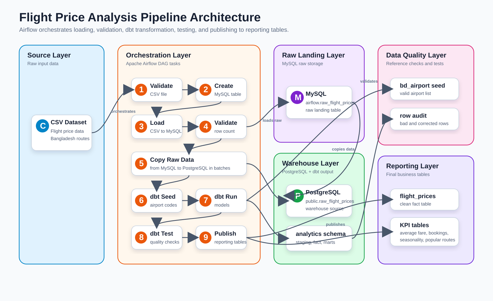

# Flight Price Analysis Pipeline

This project is a data pipeline for the Bangladesh flight price dataset.

The pipeline does these steps:

1. Reads a CSV file with flight price data.
2. Loads the raw data into MySQL.
3. Copies the raw data from MySQL to PostgreSQL.
4. Uses dbt to clean, test, and transform the data in PostgreSQL.
5. Publishes final reporting tables in PostgreSQL.

Apache Airflow controls the full process.

## Why MySQL and PostgreSQL Are Both Used

MySQL is used as the raw landing database. This means the original CSV data is stored there first.

PostgreSQL is used as the data warehouse. dbt transformations are done in PostgreSQL because this project does not use a direct dbt transformation setup for MySQL.

So the flow is:

```text
CSV file -> MySQL raw table -> PostgreSQL warehouse -> dbt models -> reporting tables
```

## Project Structure

```text
.
├── dags/
│   ├── flight_price_analysis_pipeline.py   # Main Airflow pipeline
│   ├── welcome.py                          # Simple sample DAG
│   └── data/
│       └── Flight_Price_Dataset_of_Bangladesh.csv
├── dbt/
│   ├── models/                             # dbt staging, quality, and KPI models
│   ├── seeds/                              # Airport reference data
│   ├── dbt_project.yml
│   └── profiles.yml
├── docs/
│   ├── pipeline_report.md                  # Full project report
│   └── assets/
│       └── pipeline_architecture.png       # Pipeline architecture image
├── Dockerfile
├── docker-compose.yaml
├── pyproject.toml
└── README.md
```

## Main Tools

- Apache Airflow: runs the pipeline tasks.
- MySQL: stores the raw CSV data.
- PostgreSQL: stores warehouse, analytics, and reporting tables.
- dbt: cleans, transforms, and tests the data.
- Docker Compose: starts all services together.
- Redis: supports Airflow Celery workers.

## Pipeline Architecture

The architecture image is available here:



More details are in [docs/pipeline_report.md](docs/pipeline_report.md).

## Main Airflow DAG

The main DAG is:

```text
flight_price_analysis_pipeline
```

It is located at:

```text
dags/flight_price_analysis_pipeline.py
```

The DAG is manually triggered. It does not run on a schedule.

## Airflow Task Flow

The main DAG runs these tasks:

1. `validate_csv_file`
   - Checks that the CSV file exists.
   - Checks that the CSV file has the expected columns.
   - Counts the number of rows.

2. `create_mysql_raw_table`
   - Creates the MySQL raw table.
   - The table name is `raw_flight_prices`.

3. `load_csv_to_mysql`
   - Loads the CSV file into MySQL.

4. `validate_mysql_load`
   - Checks that the number of rows in MySQL matches the CSV row count.

5. `load_data_to_postgres_from_mysql`
   - Reads data from MySQL.
   - Loads it into PostgreSQL table `public.raw_flight_prices`.
   - Uses simple snake_case column names in PostgreSQL.

6. `run_dbt_seed`
   - Runs `dbt seed`.
   - Loads airport reference data from `dbt/seeds/bd_airport.csv`.

7. `run_dbt_models`
   - Runs `dbt run`.
   - Builds staging, quality, clean fact, and KPI tables.

8. `run_dbt_test`
   - Runs `dbt test`.
   - Checks important fields for missing values.

9. `publish_transformed_data_to_postgres`
   - Copies final dbt tables from the `analytics` schema to the `reporting` schema.
   - Stops publishing if the clean flight price table is empty.

## dbt Models

The dbt project is inside the `dbt/` folder.

Important models:

- `stg_flight_prices`
  - Cleans raw data.
  - Trims text fields.
  - Converts airport codes to uppercase.
  - Calculates total fare from base fare and tax.
  - Creates the peak season flag.

- `bd_flight_fare_row_audit`
  - Finds bad rows.
  - Checks missing values, negative fares, invalid airport codes, and wrong total fare values.

- `flight_prices`
  - Final clean flight price table.
  - Removes rows found in the audit table.

- `average_fare_by_airline`
  - Shows average fare by airline.

- `booking_count_by_airline`
  - Shows number of records by airline.

- `seasonal_fare_variation`
  - Compares peak and non-peak season fares.

- `most_popular_routes`
  - Shows the most common routes.

## Final Reporting Tables

The final tables are published to the PostgreSQL `reporting` schema:

- `reporting.flight_prices`
- `reporting.average_fare_by_airline`
- `reporting.booking_count_by_airline`
- `reporting.seasonal_fare_variation`
- `reporting.most_popular_routes`
- `reporting.bd_flight_fare_row_audit`

## Requirements

You need:

- Docker
- Docker Compose

You do not need to install Airflow, MySQL, PostgreSQL, or dbt manually if you run the project with Docker Compose.

## Environment Setup

Create a `.env` file from the example file:

```bash
cp .env.example .env
```

Then update the values in `.env`, especially:

- `POSTGRES_PASSWORD`
- `MYSQL_ROOT_PASSWORD`
- `MYSQL_PASSWORD`
- `AIRFLOW__CORE__FERNET_KEY`
- `AIRFLOW__API_AUTH__JWT_SECRET`
- `_AIRFLOW_WWW_USER_PASSWORD`

You can generate a Fernet key with:

```bash
python -c "from cryptography.fernet import Fernet; print(Fernet.generate_key().decode())"
```

## Start the Project

Build the Airflow image:

```bash
docker compose build
```

Initialize Airflow:

```bash
docker compose up airflow-init
```

Start all services:

```bash
docker compose up -d
```

Open Airflow in the browser:

```text
http://localhost:8080
```

The Airflow username and password come from the `.env` file.

## Run the Pipeline

1. Open Airflow at `http://localhost:8080`.
2. Find the DAG named `flight_price_analysis_pipeline`.
3. Unpause the DAG if it is paused.
4. Trigger the DAG manually.
5. Wait for all tasks to finish successfully.

After the DAG finishes, check the final tables in PostgreSQL under the `reporting` schema.

## Useful Commands

Start all services:

```bash
docker compose up -d
```

Stop all services:

```bash
docker compose down
```

View running containers:

```bash
docker compose ps
```

View Airflow scheduler logs:

```bash
docker compose logs -f airflow-scheduler
```

Open a MySQL shell:

```bash
docker compose exec mysql mysql -u "$MYSQL_USER" -p"$MYSQL_PASSWORD" "$MYSQL_DATABASE"
```

Open a PostgreSQL shell:

```bash
docker compose exec postgres psql -U "$POSTGRES_USER" -d "$POSTGRES_DB"
```

## Documentation

A full report is available here:

[docs/pipeline_report.md](docs/pipeline_report.md)

It explains:

- Pipeline architecture and execution flow.
- Airflow DAG and task descriptions.
- KPI definitions and computation logic.
- The MySQL and dbt challenge, and how PostgreSQL solved it.
